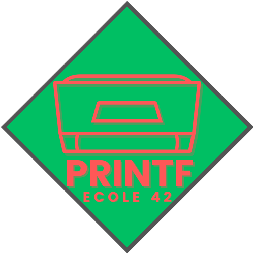

  
  <h2>42 PRINTF PROJECT</h2>
    
    
    
    
    
   
<h4>
    <a href="https://github.com/emre-mr246/42_ring1_printf/issues">❔ Ask a Question</a>
   · 
    <a href="https://github.com/emre-mr246/42_ring1_printf/issues">🪲 Report Bug</a>
   · 
    <a href="https://github.com/emre-mr246/42_ring1_printf/issues">💬 Request Feature</a>
</h4>

## Introduction 🚀

In this project, we implemented a simplified version of the `printf` function from the standard C library. The `ft_printf` function replicates much of the functionality of the original `printf`, allowing formatted output to various streams, such as standard output or files.

## Usage 🔍

Since printf has been added to libft, you can directly call it by linking with the libft library.

<a href="https://github.com/emre-mr246/42_ring0_libft"> Click here to go to the libft repository.</a>
